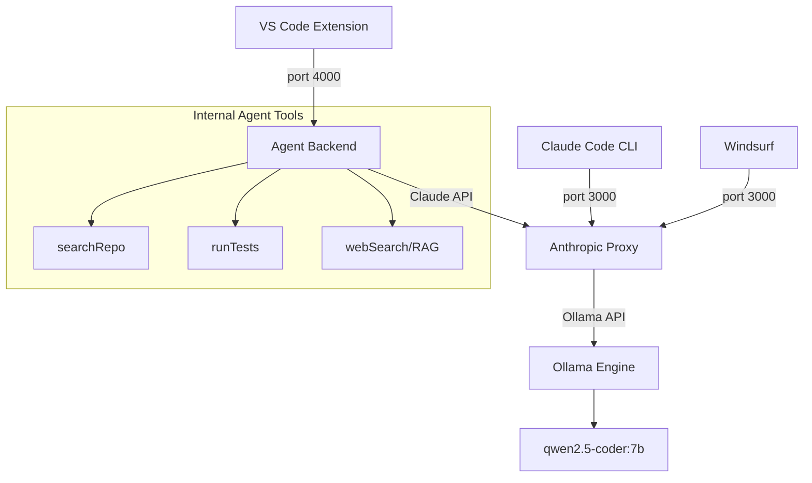

# 🤖 Local Claude Coding Agent

[](https://github.com/tamaxhh/Claude_code_Local_Setup)
[](https://opensource.org/licenses/MIT)
[](https://github.com/tamaxhh/Claude_code_Local_Setup)

A powerful, fully **local AI coding assistant** tailored for software engineers. Run high-performance models (like `qwen2.5-coder`) directly on your hardware (optimized for NVIDIA 3060+) without data ever leaving your machine.

**No API costs. No internet required. Full privacy.**

---

## ✨ Features

- 🏎️ **Optimized Performance**: Leverages Ollama for fast, local inference.
- 🛠️ **Tool-Augmented**: The agent can search your repository, run tests, and even access web documentation.
- 🔌 **Seamless Integration**: Works out-of-the-box with **VS Code**, **Windsurf**, and the **Claude Code CLI**.
- 🔍 **RAG Powered**: (Phase 5) Smart context retrieval from your codebase and web search results.
- 🛡️ **Privacy First**: Your code never leaves your local network.

---

## 🏗️ Architecture



---

## 🚀 Quick Start

### 1. Prerequisites
Ensure you have [Ollama](https://ollama.com/) installed and running.

```powershell
# Pull the recommended model
ollama pull qwen2.5-coder:7b
```

### 2. Start Services
Run the automated startup script to launch the proxy and agent backend.

```powershell
cd "c:\My Project\Claude_local_setup"
.\scripts\start-all.ps1
```

### 3. Verify Setup
Run the health check script to ensure the proxy is responding correctly.

```powershell
.\scripts\test-proxy.ps1
```

### 4. Integration Guides

#### VS Code Extension
1. Open the `vscode-extension` folder in a new VS Code window.
2. Run `npm install && npm run compile`.
3. Press `F5` to start the extension development host.
4. **Right-click** any code snippet to use **Explain**, **Refactor**, or **Implement**.

#### Claude Code CLI
Point the CLI to your local proxy:
```powershell
$env:ANTHROPIC_BASE_URL = "http://localhost:3000"
$env:ANTHROPIC_API_KEY  = "local-model"
claude
```

---

## 📁 Project Structure

| Folder | Responsibility |
| :--- | :--- |
| [`proxy/`](./proxy) | Translates Anthropic API calls to Ollama-compatible requests. |
| [`agent-backend/`](./agent-backend) | The "brain" — handles tool use, RAG, and planning. |
| [`vscode-extension/`](./vscode-extension) | Native VS Code integration for a seamless UI experience. |
| [`scripts/`](./scripts) | Automation scripts for lifecycle management. |
| [`windsurf-config/`](./windsurf-config) | Configuration guides for Windsurf users. |

See [**project_structure.md**](./project_structure.md) for a deep dive into the architecture.

---

## ⚙️ Configuration

### Agent Environment (`agent-backend/.env`)
```env
AGENT_PORT=4000
PROXY_BASE_URL=http://localhost:3000
WORKSPACE_ROOT=C:\My Project\Claude_local_setup
BRAVE_API_KEY= # Optional for web search
```

### Proxy Environment (`proxy/.env`)
```env
OLLAMA_BASE_URL=http://localhost:11434
OLLAMA_MODEL=qwen2.5-coder:7b
PROXY_PORT=3000
```

---

## 🛑 Stopping Services

To safely shut down all backend processes, run:
```powershell
.\scripts\stop-all.ps1
```

---

## 🤝 Contributing

Contributions are welcome! Please feel free to submit a Pull Request.

1. Fork the Project
2. Create your Feature Branch (`git checkout -b feature/AmazingFeature`)
3. Commit your Changes (`git commit -m 'Add some AmazingFeature'`)
4. Push to the Branch (`git checkout origin feature/AmazingFeature`)
5. Open a Pull Request

---

*Built with ❤️ for the developer community.*
